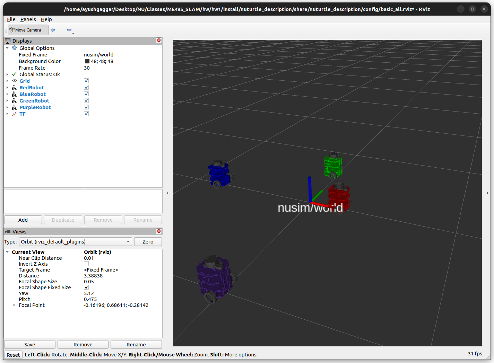

# Nuturtle  Description
URDF files for Nuturtle vroomba
* `ros2 launch nuturtle_description load_one.launch.py` to see the robot in rviz.
    Note that paramaters such as color can be changed. See below.
    
* `ros2 launch nuturtle_description load_all.launch.xml` to see four copies of the robot in rviz.

* The rqt_graph when all four robots are visualized (Nodes Only, Hide Debug) is:

# Launch Files: Details, Parameters, etc.
* ` ros2 launch nuturtle_description load_one.launch.py --show-args`
  `Arguments (pass arguments as '<name>:=<value>'):

    'color':
        Choices for the color of baselink, and the name of thenamespace; defaults to purple. Valid choices are: ['red', 'green', 'blue', 'purple']
        (default: 'purple')

    'model':
        Absolute path to robot urdf file
        (default: '/home/ayushgaggar/Desktop/NU/Classes/ME495_SLAM/hw/hw1/install/nuturtle_description/share/nuturtle_description/urdf/turtlebot3_burger.urdf.xacro')

    'rvizconfig':
        Absolute path to rviz config file
        (default: '/home/ayushgaggar/Desktop/NU/Classes/ME495_SLAM/hw/hw1/install/nuturtle_description/share/nuturtle_description' + '/config/basic_' + LaunchConfig('color') + '.rviz')

    'use_jsp':
        Choices for joint state publisher, defaults to true. Valid choices are: ['true', 'false']
        (default: 'true')

    'use_rviz':
        Choices for whether to launch rviz, defaults to true. Valid choices are: ['true', 'false']
        (default: 'true')`
* `ros2 launch nuturtle_description load_all.launch.xml --show-args`
  `Arguments (pass arguments as '<name>:=<value>'):

    'color':
        Choices for the color of baselink, and the name of thenamespace; defaults to purple. Valid choices are: ['red', 'green', 'blue', 'purple']
        (default: 'purple')

    'model':
        Absolute path to robot urdf file
        (default: '/home/ayushgaggar/Desktop/NU/Classes/ME495_SLAM/hw/hw1/install/nuturtle_description/share/nuturtle_description/urdf/turtlebot3_burger.urdf.xacro')

    'rvizconfig':
        Absolute path to rviz config file
        (default: '/home/ayushgaggar/Desktop/NU/Classes/ME495_SLAM/hw/hw1/install/nuturtle_description/share/nuturtle_description' + '/config/basic_' + LaunchConfig('color') + '.rviz')

    'use_jsp':
        Choices for joint state publisher, defaults to true. Valid choices are: ['true', 'false']
        (default: 'true')

    'use_rviz':
        Choices for whether to launch rviz, defaults to true. Valid choices are: ['true', 'false']
        (default: 'true')`